# Nolphin

**Ein nativer Linux-Dateimanager für Linux Mint Cinnamon – mit einem festen rechten Arbeitsbereich für Vorschau, Eigenschaften, Archive, Terminal, Git und Paketbau.**

Nolphin ist ein eigenständiger Dateimanager auf Basis von Nemo 6.7.7 (GTK3, C11). Er wurde vollständig in **Nolphin** umbenannt und um eigene Funktionen erweitert. Die Hauptansicht bleibt sichtbar, während rechts daneben die jeweils gewählte Funktion bedient wird – ohne zusätzliche Fenster.

> **Hinweis:** Nolphin ist ein unabhängiges Open-Source-Projekt und kein offizielles Projekt von Linux Mint.

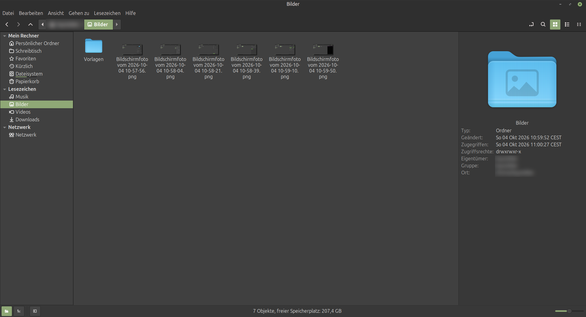

---

## Projektphilosophie

**Die Funktion kommt zur Datei – nicht umgekehrt.**

Wer mit technischen Dateien arbeitet, wechselt sonst ständig zwischen Dateimanager, Terminal und Zusatzprogrammen. Nolphin holt diese Werkzeuge in das Hauptfenster.

* **Ehrlich statt vorgetäuscht:** Fehlt ein Hilfsprogramm oder ein Vorschau-Backend, zeigt Nolphin das an, statt eine Funktion zu simulieren.
* **Vertraute Bedienung:** Die klassische Nemo-Bedienung bleibt erhalten.
* **Nur Belegtes ist fertig:** Diese README beschreibt den Stand des Codes. Als „umgesetzt“ gilt, was im Code vorhanden ist, als „getestet“ nur, was die Meson-Tests abdecken.

---

## Schnellstart

Aus dem Quellcode bauen und direkt aus dem Build-Verzeichnis starten:

```bash
meson setup build
ninja -C build
env GSETTINGS_SCHEMA_DIR="$(pwd)/build/libnolphin-private" \
    LD_LIBRARY_PATH="$(pwd)/build/libnolphin-extension" \
    ./build/src/nolphin
```

Mit **F11** blendest du den rechten Arbeitsbereich ein, mit **F4** das Terminal.

Voraussetzungen, Installation und Tests: siehe [Bauen und Installieren](#bauen-und-installieren).

---

## Highlights

* **Rechter Arbeitsbereich (F11):** ein fester Bereich, in dem Vorschau, Eigenschaften, Archiv, Terminal, Git, DEB-Ersteller und Massenumbenennung geöffnet werden.
* **Archive:** Komprimieren und Entpacken über die installierten Systemwerkzeuge, Argumente nie über eine Shell.
* **DEB-Pakete erstellen:** Nolphin baut ein `.deb` selbst als `ar`-Archiv, ohne `dpkg-deb`.
* **Massenumbenennung:** Suchen/Ersetzen, Nummerierung und Groß-/Kleinschreibung mit Vorschau der neuen Namen, rückgängig machbar.
* **CAD- und 3D-Erkennung:** STL, STEP/STP, FreeCAD `.FCStd` und weitere Formate.
* **Git direkt im Dateimanager:** Änderungen anzeigen, speichern, mit dem Server abgleichen, Verlauf und Unterschiede.
* **Sicherheit:** Prüfsummen, GPG-Verschlüsselung, ACL-Verwaltung.
* **Papierkorb-Automatik** und **gespeicherte Dateiauswahlen**.
* **Nemo-Grundlagen:** Tabs, Split View, Symbol-, Listen- und Kompaktansicht, Fortschritt, Rückgängig, Netzwerk über GVfs.

---

## Der rechte Arbeitsbereich

```text
┌──────────────────────────────────────────────────────────────────┐
│ Menü / Werkzeugleiste / Adresse                                  │
├──────────────┬──────────────────────────┬────────────────────────┤
│ Seitenleiste │ Hauptansicht             │ Arbeitsbereich         │
│ Orte         │ Dateien und Ordner       │   Vorschau (Ruhelage)  │
│              │                          │   Eigenschaften        │
│              │                          │   Archiv               │
│              │                          │   Terminal             │
│              │                          │   Suche                │
│              │                          │   Git                  │
│              │                          │   DEB-Ersteller        │
│              │                          │   Massenumbenennung    │
├──────────────┴──────────────────────────┴────────────────────────┤
│ Statusleiste                                                     │
└──────────────────────────────────────────────────────────────────┘
```

| Panel | Aufruf | Inhalt |
| ----- | ------ | ------ |
| Vorschau / Information | **F11** | Vorschau und Dateiinformationen; hierhin kehrt der Arbeitsbereich zurück |
| Eigenschaften | Menü, Kontextmenü | Zugriffsrechte, Besitzer, Gruppe, ACL |
| Archiv | Menü, Kontextmenü | Komprimieren |
| Terminal | **F4** | VTE-Terminal im aktuellen Ordner |
| Suche | Suchaktion | Such- und Filterleiste |
| Git | Menü, Kontextmenü | Status und Aktionen |
| DEB-Ersteller | Menü, Kontextmenü | `.deb`-Paket aus Dateien und Ordnern |
| Massenumbenennung | Menü | Umbenennen mit Vorschau |

Ein Panel wird im Arbeitsbereich wiederverwendet und öffnet kein zusätzliches Fenster. Klassische Dialoge gibt es weiterhin für Dateiauswahl, Lösch- und Überschreibbestätigungen, Fehlermeldungen, Mount-Zugangsdaten und „Über Nolphin“.

### So sehen die Panels aus

**Eigenschaften** – Zugriffsrechte, Besitzer und Gruppe sowie zusätzliche Benutzer und Gruppen (ACL), ohne das Hauptfenster zu verlassen:

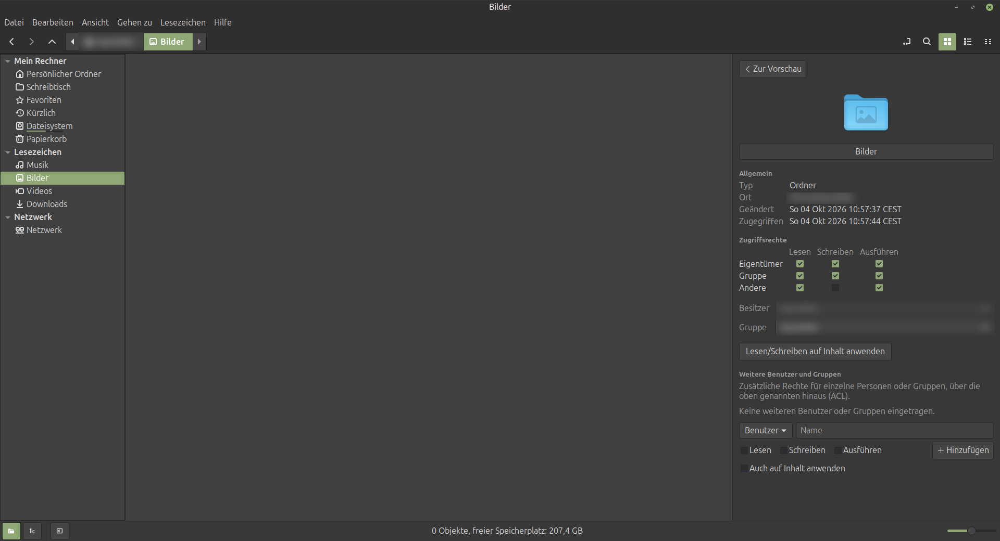

**Symbol auswählen** – ein Symbol für Ordner oder Dateien wählen, durchsuchbar und nach Kategorien sortiert:

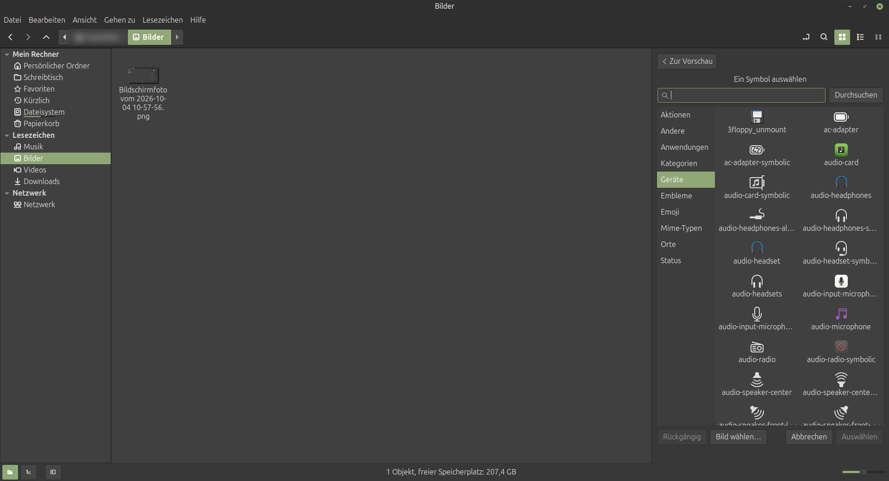

**Git** – Änderungen anzeigen, speichern (Commit), mit dem Server abgleichen, Verlauf und Unterschiede. Außerhalb eines Repositorys meldet das Panel das ehrlich:

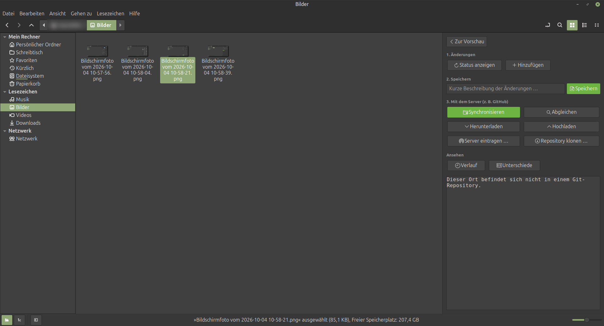

**Archiv** – Name, Format und Zielort wählen; Passwort und Teilarchive stehen unter „Erweiterte Optionen“:

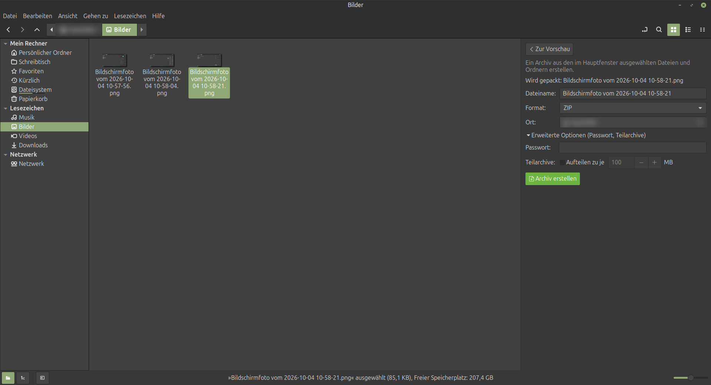

**DEB-Ersteller** – Paketname, Version, Beschreibung und Ersteller eintragen, Dateien und Ordner mit Zielpfad hinzufügen und das Paket erstellen:


**Terminal (F4)** – das eingebettete Terminal öffnet im aktuellen Ordner und bleibt neben der Hauptansicht:

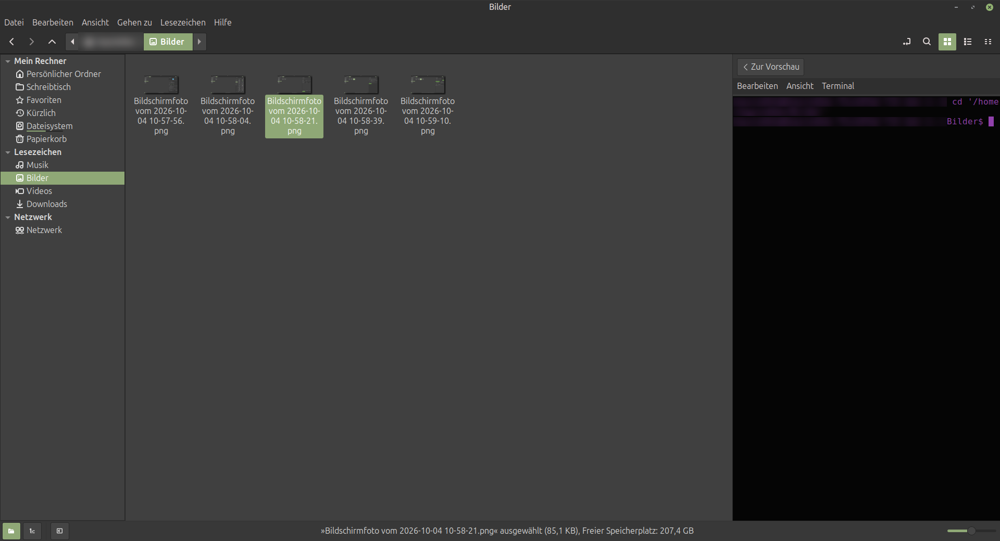

---

## Funktionen im Detail

### Dateiverwaltung

Tabs, Split View (F3), Symbol-, Listen- und Kompaktansicht, Kopieren und Verschieben mit Pause und Abbruch, Rückgängig und Wiederholen, Papierkorb, Drag & Drop, Berechtigungen, Netzwerkzugriff über GVfs (SMB, NFS, HTTP, HTTPS).

### Archive

| Erstellen und Entpacken | Nur Entpacken und Auslesen (über `7z`) |
| ----------------------- | -------------------------------------- |
| ZIP, TAR, TAR.GZ, TAR.BZ2, TAR.XZ, TAR.ZST, TAR.LZ4, 7Z | CAB, ARJ, LZH, ISO, CPIO, RPM, DEB |
| Einzeldateien: XZ, ZST, LZ4 | |

Ist das benötigte Werkzeug nicht installiert, wird das erkannt und angezeigt.

### DEB-Paket erstellen

Der Ersteller (`src/nolphin-deb-builder.c`) schreibt das Paket aus `debian-binary`, `control.tar.gz` und `data.tar.gz` direkt als `ar`-Archiv. Pflichtfelder sind Paketname, Version, Architektur, Maintainer und Beschreibung. Sektion, Priorität, Abhängigkeiten und Homepage sind optional.

### CAD- und 3D-Dateien

* **STL:** ASCII oder binär, bei Binär-STL die Anzahl der Dreiecke
* **STEP/STP:** Header-Informationen (Beschreibung, Dateiname, Zeitstempel, Autor, Schema)
* **FreeCAD `.FCStd`:** Dokumentinformationen und eingebettetes Vorschaubild
* **IGES, OBJ, 3MF, DXF, DWG:** Erkennung; gibt es für ein Format noch keine echte Vorschau, steht das ausdrücklich da

### Prüfsummen, Verschlüsselung, ACL

* **Prüfsummen:** MD5, SHA-1, SHA-256, SHA-512, BLAKE2
* **Verschlüsselung:** GPG
* **ACL:** Verwaltung über `getfacl` und `setfacl`

### Papierkorb und Auswahlen

Der Papierkorb wird nach einer einstellbaren Aufbewahrungsdauer bereinigt, bei Überschreiten eines Größenlimits erscheint eine Warnung. Benannte Dateiauswahlen lassen sich speichern und wiederherstellen.

---

## Einstellungen und Anpassung

Verhalten, Anzeige, Listenspalten, Vorschau, Werkzeugleiste, Kontextmenüs, Dokumentvorlagen und Plugins haben jeweils eine eigene Einstellungsseite.

> **Bekannt:** Einige Texte der Einstellungsseiten sind noch englisch (aus dem Nemo-Ursprung) und noch nicht ins Deutsche übersetzt.

| | |
| --- | --- |
| **Verhalten**  | **Anzeige** 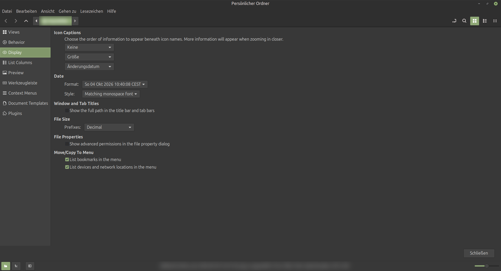 |
| **Listenspalten** 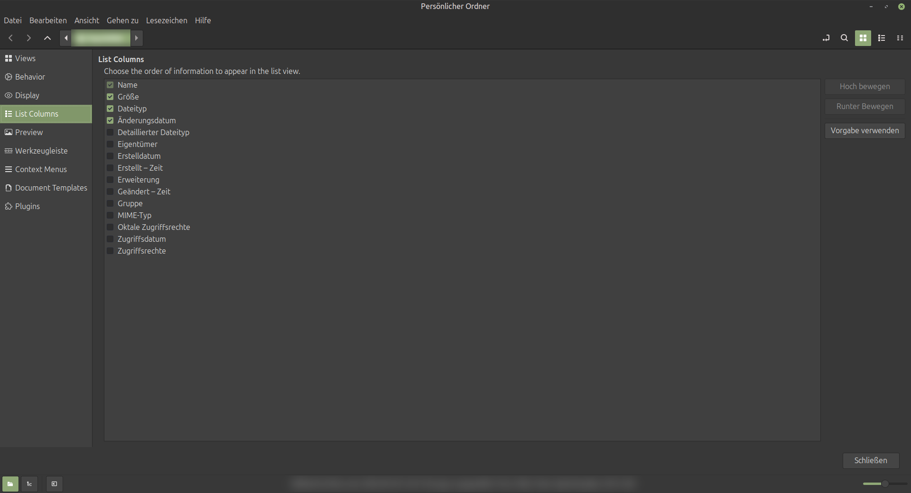 | **Vorschau** 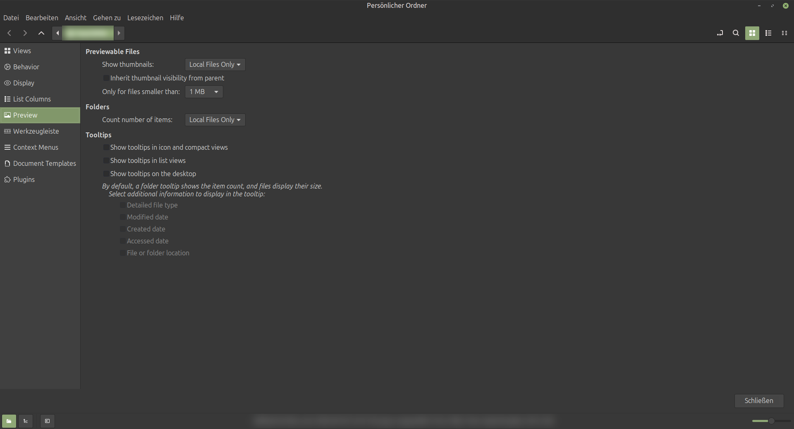 |
| **Werkzeugleiste** 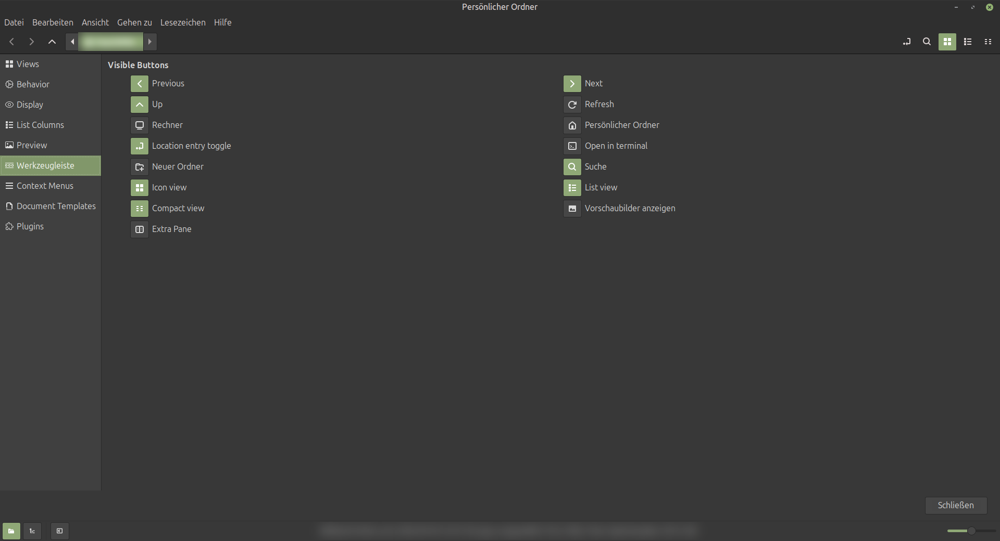 | **Kontextmenüs** 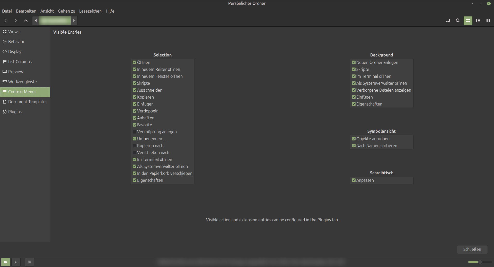 |
| **Dokumentvorlagen** 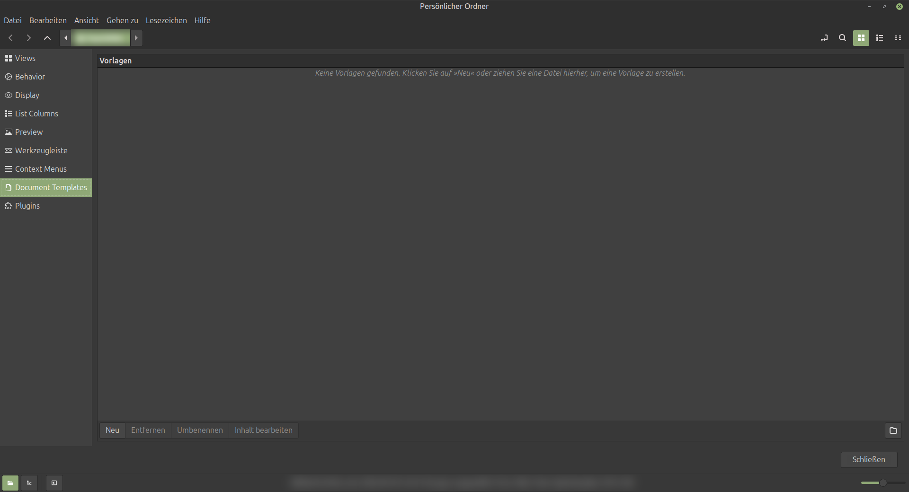 | **Plugins und Aktionen** 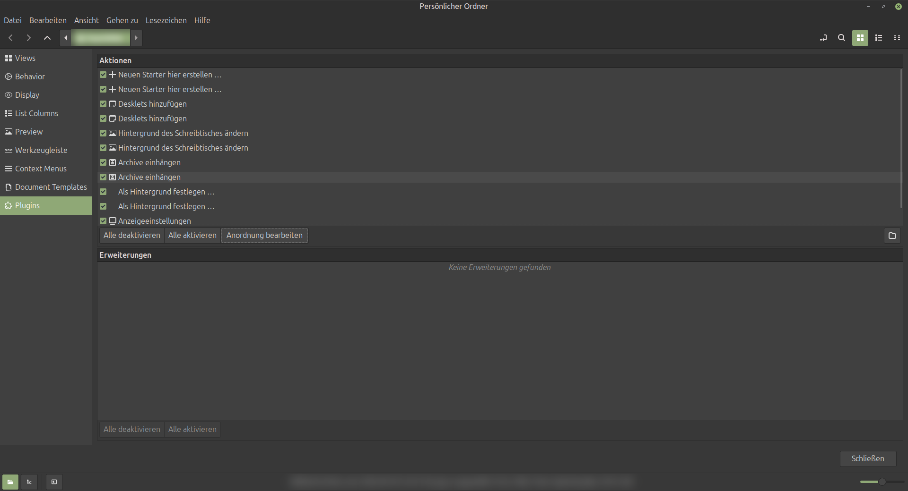 |

Reihenfolge und Aussehen der Aktionen in den Menüs bearbeitest du im Layout-Editor:

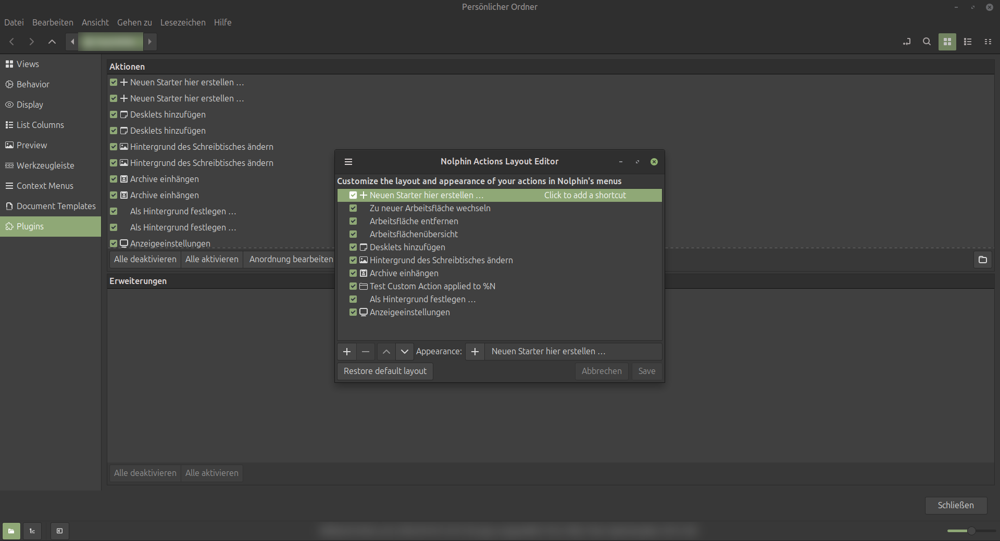

---

## Entwicklungsstand

Nolphin ist Entwicklungssoftware: Funktionen können sich ändern.

### Umgesetzt

* [x] Dateiverwaltung auf Nemo-Basis mit Tabs, Split View und Ansichten
* [x] Rechter Arbeitsbereich mit Panel-Wechsel
* [x] Vorschau- und Info-Panel
* [x] Eigenschaften im Arbeitsbereich
* [x] Integriertes Terminal (F4)
* [x] Archive komprimieren und entpacken
* [x] DEB-Paket-Ersteller
* [x] Massenumbenennung
* [x] CAD- und 3D-Erkennung (STL, STEP, FCStd u. a.)
* [x] Git-Aktionen
* [x] Prüfsummen, GPG, ACL
* [x] Papierkorb-Automatik
* [x] Gespeicherte Dateiauswahlen

### Geplant

* [ ] Erweiterte Suche: UND, ODER, NICHT, kombinierbare Filter
* [ ] Erweiterte Vorschau: PDF (Poppler-GLib), Video und Audio (GStreamer)
* [ ] Metadaten: Tags, Bewertungen, Kommentare
* [ ] Arbeitsbereiche: Layout, Tabs und Terminal speichern und benennen
* [ ] Netzwerk: SFTP, FTP, WebDAV prüfen
* [ ] Automatische Regeln, Synchronisation über `rsync`, Versionierung, Duplikaterkennung
* [ ] Diagnose-Dialog mit Fehlerbericht-Export

### Teststand

`meson test -C build` (Stand: 4. Oktober 2026): **13 von 16 Tests bestehen.**

| Test | Ergebnis |
| ---- | -------- |
| Copy test | Fehler |
| Search Engine test | Timeout nach 30 s |
| Directory Async test | Timeout nach 30 s |

Diese drei Punkte sind offen und nicht als erledigt zu betrachten.

---

## Nolphin und Nemo

| Bereich | Nemo | Nolphin |
| ------- | :--: | :-----: |
| Klassische Dateiverwaltung, Tabs, Split View | ✓ | ✓ |
| Integriertes Terminal | ✓ | ✓ (im Arbeitsbereich) |
| Rechter Arbeitsbereich mit Panels | – | ✓ |
| Archive im Panel | – | ✓ |
| DEB-Paket-Ersteller | – | ✓ |
| Massenumbenennung mit Vorschau | – | ✓ |
| STL-, STEP- und FCStd-Informationen | – | ✓ |
| Git-Aktionen | – | ✓ |
| Prüfsummen, GPG, ACL | – | ✓ |
| Papierkorb-Automatik | – | ✓ |
| Gespeicherte Dateiauswahlen | – | ✓ |

---

## Bauen und Installieren

### Voraussetzungen

Nolphin läuft ausschließlich unter Linux und ist für Linux Mint mit Cinnamon optimiert.

* Meson (≥ 0.64), Ninja, C-Compiler (C11)
* GTK3, GLib, GIO, GVfs, VTE 2.91, XApp, cinnamon-desktop
* optional: libexif, exempi
* Laufzeitwerkzeuge, je nach Funktion: `zip`/`unzip`, `tar`, `7z`, `zstd`, `lz4`, `xz`, `git`, `gpg`, `getfacl`/`setfacl`

### Bauen und testen

```bash
meson setup build
ninja -C build
meson test -C build
```

### Installieren

```bash
sudo ninja -C build install
```

Installationsweg und Paketierung (`debian/`) können sich während der Entwicklung ändern.

---

## Projektstruktur

```text
src/                    Hauptquellcode (Fenster, Ansichten, Panels)
libnolphin-private/     interne Bibliothek (Archiv, Prüfsummen, ACL, GPG, Schemas)
libnolphin-extension/   Erweiterungs-Schnittstelle
gresources/             Beschreibungen der Oberfläche
test/                   Tests
docs/                   Referenzdokumente, Bilder für diese README (docs/bilder/)
debian/                 Debian-Paketierung
po/                     Übersetzungsdateien
```

Die Einstellungen liegen im GSettings-Schema `org.nolphin` (`libnolphin-private/org.nolphin.gschema.xml`).

### Weitere Dokumente

| Thema | Dokument |
| ----- | -------- |
| Drag & Drop | [docs/dnd.txt](docs/dnd.txt) |
| Tastatur und Maus | [docs/key_mouse_navigation.txt](docs/key_mouse_navigation.txt) |
| Ein- und Ausgabe | [docs/nolphin-io.txt](docs/nolphin-io.txt) |

---

## Herkunft

Nolphin begann als Quellstand von **Nemo 6.7.7**, wurde umbenannt, strukturell angepasst und schrittweise um eigene Funktionen erweitert. Der Verlauf steht in der Git-Historie.

---

## Fehler melden

Ein hilfreicher Bericht enthält:

```text
Nolphin-Version bzw. Commit:
Linux-Mint-Version:
Cinnamon-Version:

Problem:
Schritte zur Reproduktion:
Erwartetes Verhalten:
Tatsächliches Verhalten:
Fehlermeldungen:
```

---

## Lizenz

**GPL-2.0-or-later**, siehe [COPYING](COPYING).

---

**Nolphin – Dateien verwalten. Informationen sehen. Mehr direkt erledigen.**
