# Nolphin

**Ein nativer Linux-Dateimanager für Linux Mint Cinnamon – mit einem festen rechten Arbeitsbereich für Vorschau, Eigenschaften, Archive, Terminal, Git und Paketbau.**

Nolphin ist ein eigenständiger Dateimanager auf Basis von Nemo 6.7.7 (GTK3, C11). Er wurde vollständig in **Nolphin** umbenannt und um eigene Funktionen erweitert. Die Hauptansicht bleibt sichtbar, während rechts daneben die jeweils gewählte Funktion bedient wird – ohne zusätzliche Fenster.

> **Hinweis:** Nolphin ist ein unabhängiges Open-Source-Projekt und kein offizielles Projekt von Linux Mint.

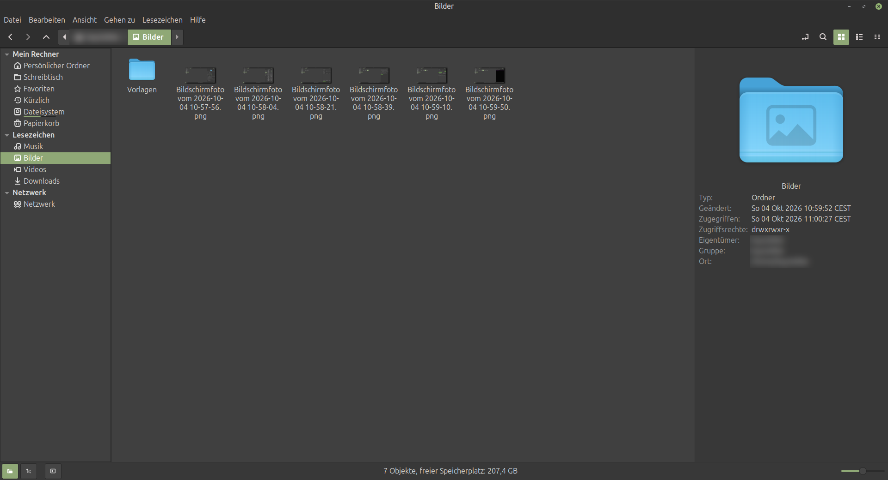

---

## Projektphilosophie

**Die Funktion kommt zur Datei – nicht umgekehrt.**

Wer mit technischen Dateien arbeitet, wechselt sonst ständig zwischen Dateimanager, Terminal und Zusatzprogrammen. Nolphin holt diese Werkzeuge in das Hauptfenster.

* **Ehrlich statt vorgetäuscht:** Fehlt ein Hilfsprogramm oder ein Vorschau-Backend, zeigt Nolphin das an, statt eine Funktion zu simulieren.
* **Kein Systembruch:** Klassische Nemo-Bedienung bleibt erhalten. Oberfläche und Menüs sind deutschsprachig.
* **Nur Dokumentiertes ist fertig:** Diese README beschreibt den lokalen Stand des Codes. Als „fertig“ gilt nur, was implementiert **und** getestet ist.

---

## Schnellstart

Aus dem Quellcode bauen und direkt aus dem Build-Verzeichnis starten:

```bash
meson setup build
ninja -C build
env GSETTINGS_SCHEMA_DIR="$(pwd)/build/libnolphin-private" \
    LD_LIBRARY_PATH="$(pwd)/build/libnolphin-extension" \
    ./build/src/nolphin
```

Danach mit **F11** den rechten Arbeitsbereich einblenden.

> Abhängigkeiten, Installation und Tests: siehe [Bauen und Installieren](#bauen-und-installieren).

---

## Highlights

* **Rechter Arbeitsbereich (F11):** ein fester Bereich mit Vorschau als Ruhelage. Eigenschaften, Archiv, Terminal, Git, DEB-Ersteller und Massenumbenennung blenden sich dort ein, sobald sie ausgelöst werden.
* **Archive:** Komprimieren und Entpacken über die installierten Systemwerkzeuge (zip, tar, 7z, zstd, lz4, xz), Argumente nie über eine Shell.
* **DEB-Pakete erstellen:** Nolphin baut ein `.deb` selbst als `ar`-Archiv, ohne `dpkg-deb`.
* **Massenumbenennung:** Suchen/Ersetzen, Nummerierung, Groß-/Kleinschreibung mit Vorschau der neuen Namen.
* **CAD-/3D-Erkennung:** STL, STEP/STP, FreeCAD `.FCStd` und weitere Formate.
* **Git im Kontextmenü und im Panel:** Status, Add, Commit, Pull, Push, Log, Diff, Remote.
* **Sicherheit:** Prüfsummen, GPG-Verschlüsselung, ACL-Verwaltung (`getfacl`/`setfacl`).
* **Papierkorb-Automatik:** Bereinigung nach Aufbewahrungsdauer und Warnung bei Größenlimit.
* **Gespeicherte Dateiauswahlen:** benannte Auswahlen speichern und wiederherstellen.
* **Nemo-Grundlagen:** Tabs, Split View, Symbol-/Listen-/Kompaktansicht, Fortschritt, Rückgängig, Papierkorb, Netzwerk über GVfs.

---

## Der rechte Arbeitsbereich

```text
┌──────────────────────────────────────────────────────────────┐
│ Menü / Werkzeugleiste / Adresse                              │
├────────────┬────────────────────────────┬────────────────────┤
│ Seitenleiste│ Hauptansicht              │ Arbeitsbereich     │
│ Orte / Baum │ Dateien und Ordner        │ Vorschau (Ruhelage)│
│            │                            │ Eigenschaften      │
│            │                            │ Archiv             │
│            │                            │ Terminal (F4)      │
│            │                            │ Suche              │
│            │                            │ Git                │
│            │                            │ DEB-Ersteller      │
│            │                            │ Massenumbenennung  │
├────────────┴────────────────────────────┴────────────────────┤
│ Statusleiste                                                 │
└──────────────────────────────────────────────────────────────┘
```

| Panel | Aufruf | Inhalt |
| ----- | ------ | ------ |
| Vorschau / Information | **F11** | Vorschau und Dateiinformationen, Rückkehrzustand für alle anderen Panels |
| Eigenschaften | Alt+Enter, Kontextmenü | Eigenschaften und Berechtigungen |
| Archiv | Menü, Kontextmenü | Komprimieren, Entpacken |
| Terminal | **F4** | VTE-Terminal im aktuellen Ordner |
| Suche | Suchaktion | Such- und Filterleiste |
| Git | Menü, Kontextmenü | Git-Status und -Aktionen |
| DEB-Ersteller | Menü, Kontextmenü | `.deb`-Paket aus ausgewählten Dateien |
| Massenumbenennung | Menü | Umbenennen mit Live-Vorschau |

Ein Panel wird im Arbeitsbereich wiederverwendet, es öffnet kein zusätzliches Top-Level-Fenster. Klassische Dialoge gibt es weiterhin für Dateiauswahl, Lösch-/Überschreibbestätigung, Fehlermeldungen, Mount-Zugangsdaten und „Über Nolphin“.

---

### So sehen die Panels aus

**Eigenschaften** – Zugriffsrechte, Besitzer und Gruppe sowie zusätzliche Benutzer und Gruppen (ACL), ohne das Hauptfenster zu verlassen:

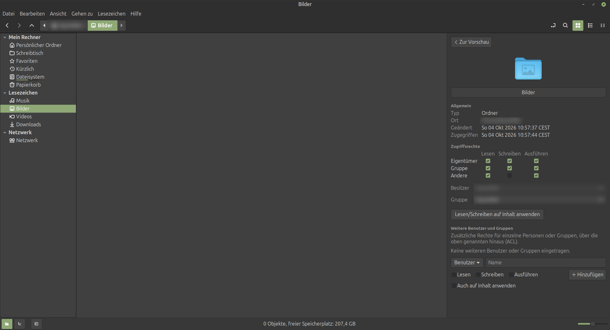

**Symbol auswählen** – eigene Symbole für Ordner und Dateien, durchsuchbar und nach Kategorien sortiert:

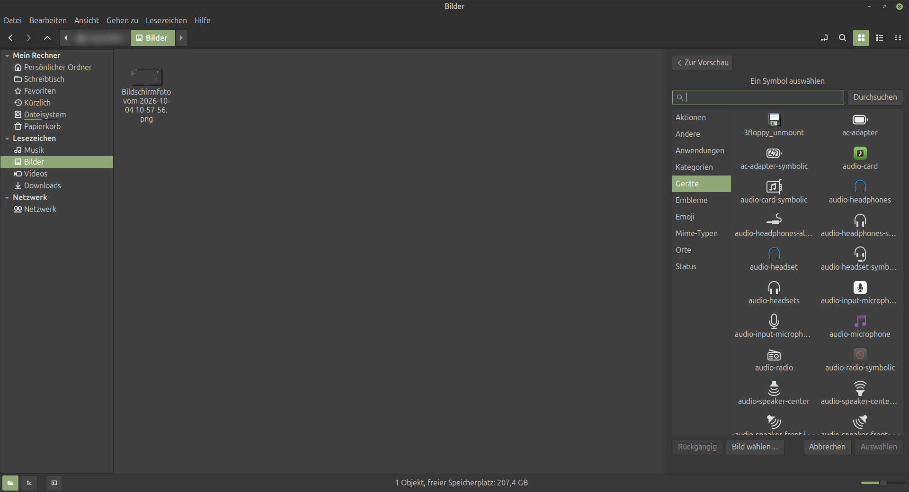

**Git** – Änderungen anzeigen, speichern (Commit), mit dem Server abgleichen, Verlauf und Unterschiede. Außerhalb eines Repositorys meldet das Panel das ehrlich:

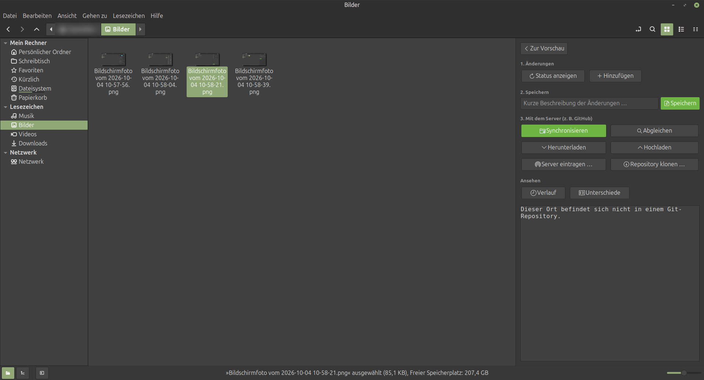

**Archiv** – Name, Format und Zielort wählen. Passwort und Teilarchive stehen unter „Erweiterte Optionen“:

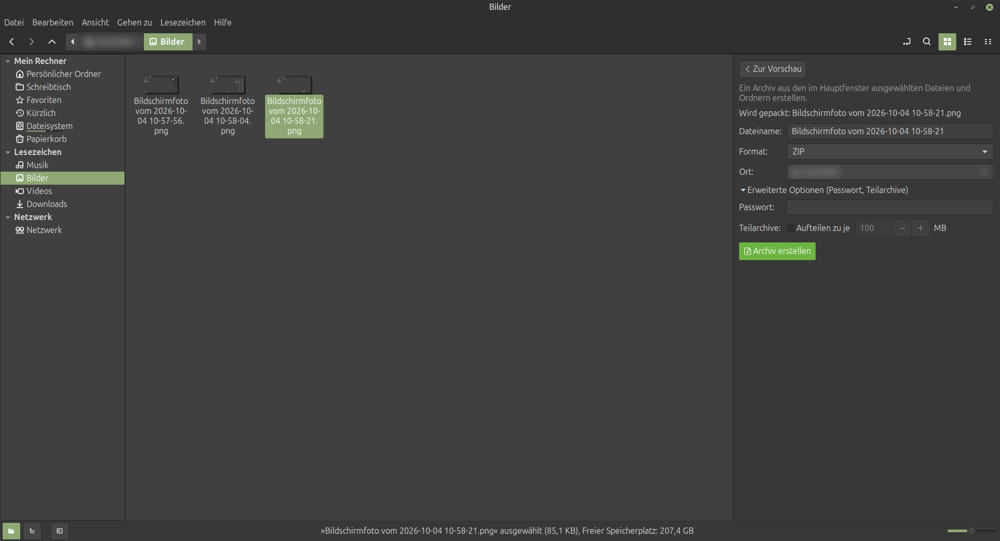

**DEB-Ersteller** – Paketname, Version, Beschreibung und Ersteller eintragen, Dateien und Ordner mit Zielpfad hinzufügen und das Paket erstellen:

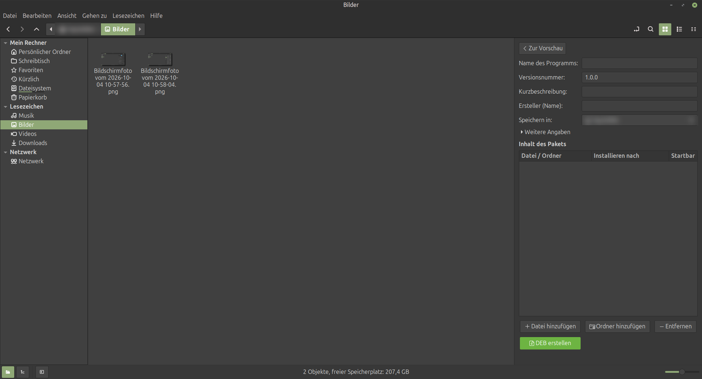

**Terminal (F4)** – das eingebettete VTE-Terminal öffnet im aktuellen Ordner und bleibt neben der Hauptansicht:

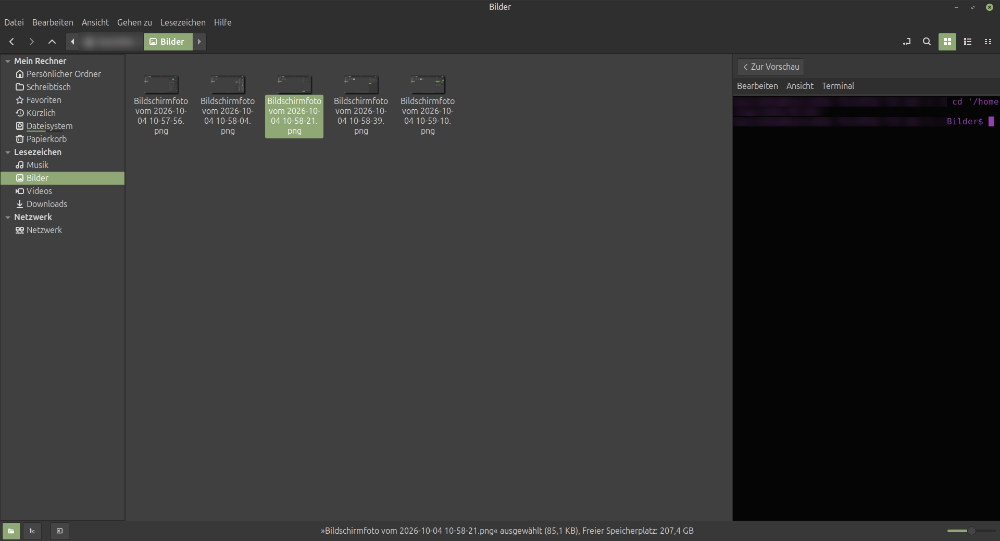

---

## Funktionen im Überblick

### Dateiverwaltung

Tabs, Split View (F3), Symbol-, Listen- und Kompaktansicht, Kopieren/Verschieben mit Pause und Abbruch, Rückgängig/Wiederholen, Papierkorb, Drag & Drop, Berechtigungen, Netzwerkzugriff über GVfs (SMB, NFS, HTTP, HTTPS).

### Archive

| Erstellen und Entpacken | Nur Entpacken/Auslesen (über `7z`) |
| ----------------------- | ---------------------------------- |
| ZIP, TAR, TAR.GZ, TAR.BZ2, TAR.XZ, TAR.ZST, TAR.LZ4, 7Z | CAB, ARJ, LZH, ISO, CPIO, RPM, DEB |
| Einzeldateien: XZ, ZST, LZ4 | |

Ist das benötigte Werkzeug nicht installiert, wird das erkannt und angezeigt.

### DEB-Paket erstellen

Der Ersteller (`src/nolphin-deb-builder.c`) schreibt das Paket (`debian-binary`, `control.tar.gz`, `data.tar.gz`) direkt als `ar`-Archiv. Pflichtfelder sind Paketname, Version, Architektur, Maintainer und Beschreibung; Sektion, Priorität, Abhängigkeiten und Homepage sind optional.


### CAD- und 3D-Dateien

* **STL:** ASCII oder binär, bei Binär-STL Dreiecksanzahl
* **STEP/STP:** Header-Informationen (Beschreibung, Dateiname, Zeitstempel, Autor, Schema)
* **FreeCAD `.FCStd`:** Dokumentinformationen und eingebettetes Vorschaubild
* **IGES, OBJ, 3MF, DXF, DWG:** Erkennung. Gibt es für ein Format noch keine echte Vorschau, steht das ausdrücklich da.

### Git, Prüfsummen, Verschlüsselung, ACL

* **Git:** Status, Add, Commit, Pull, Push, Log, Diff, Remote hinzufügen
* **Prüfsummen:** MD5, SHA-1, SHA-256, SHA-512, BLAKE2
* **Verschlüsselung:** GPG
* **ACL:** Verwaltung über `getfacl`/`setfacl`

### Papierkorb und Auswahlen

Papierkorb-Bereinigung nach Aufbewahrungsdauer (`trash-retention-days`) und Warnung bei Größenlimit (`trash-size-limit-mb`). Benannte Dateiauswahlen lassen sich speichern und wiederherstellen.

---

## Einstellungen und Anpassung

Nolphin lässt sich weitgehend anpassen: Verhalten, Anzeige, Listenspalten, Vorschau, Werkzeugleiste, Kontextmenüs, Dokumentvorlagen und Plugins/Aktionen haben jeweils eine eigene Seite.

> **Bekannt:** Einige Texte der Einstellungsseiten sind noch englisch (aus dem Nemo-Ursprung) und noch nicht ins Deutsche übersetzt.

| | |
| --- | --- |
| **Verhalten** – Navigation, Papierkorb, Medien 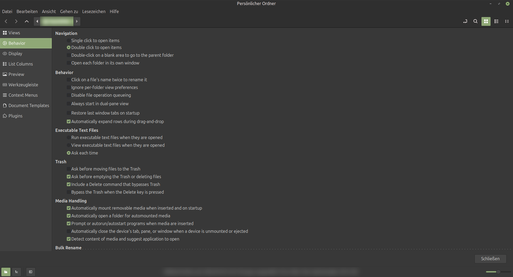 | **Anzeige** – Symbolbeschriftung, Datum, Dateigrößen 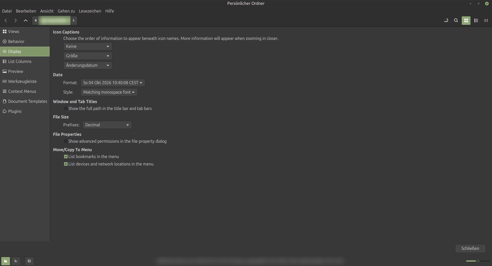 |
| **Listenspalten** – Reihenfolge und Auswahl 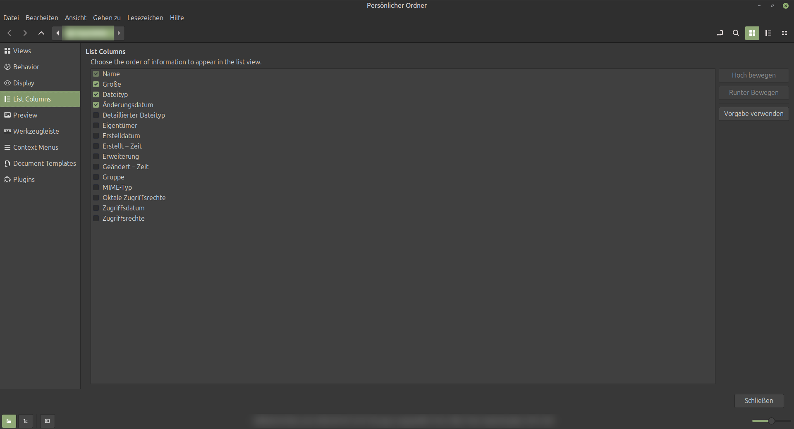 | **Vorschau** – Vorschaubilder, Ordnerzähler, Tooltips 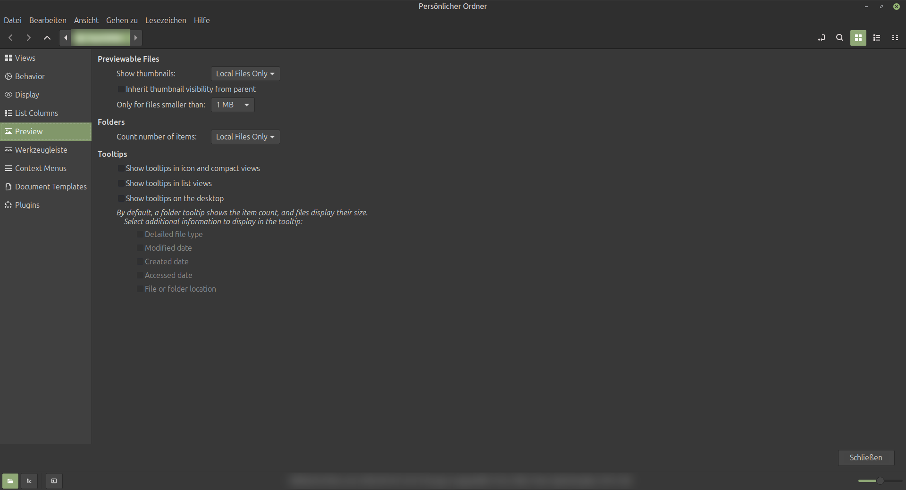 |
| **Werkzeugleiste** – sichtbare Schaltflächen 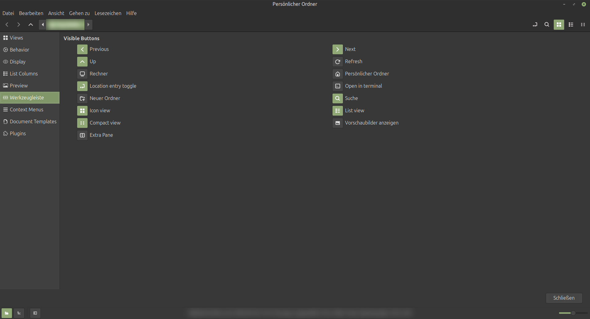 | **Kontextmenüs** – sichtbare Einträge  |
| **Dokumentvorlagen** 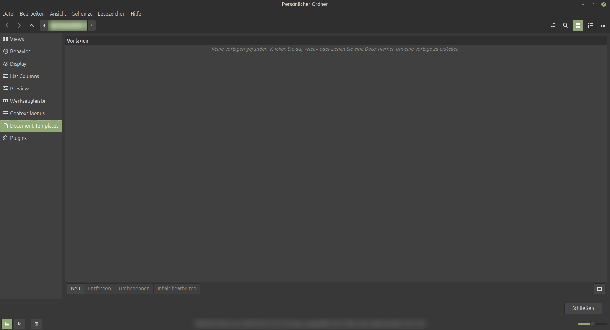 | **Plugins und Aktionen** 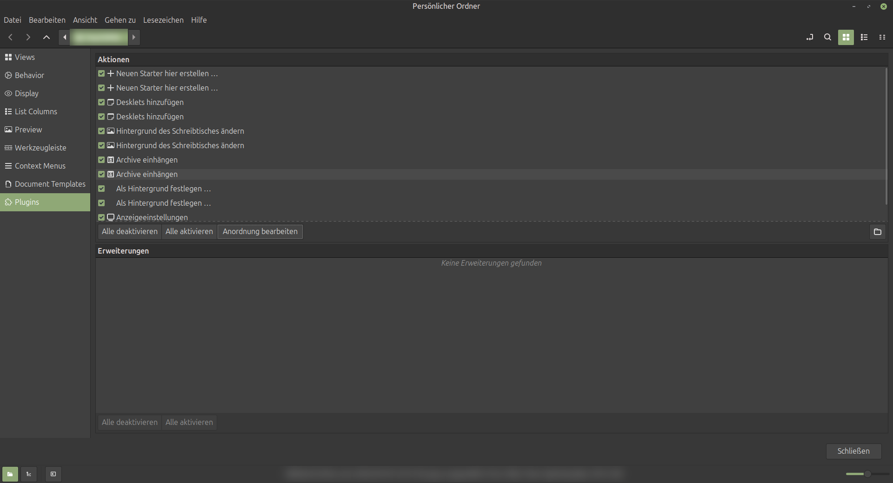 |

Die Reihenfolge und das Aussehen der Aktionen in den Menüs bearbeitest du im Layout-Editor:

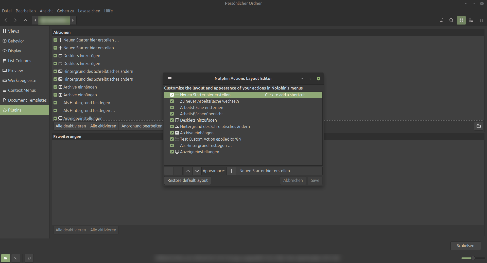

---

## Entwicklungsstand

Nolphin ist Entwicklungssoftware. „Umgesetzt“ heißt hier: im Code vorhanden. „Getestet“ bezieht sich auf die Meson-Tests.

### Umgesetzt

* [x] Dateiverwaltung auf Nemo-Basis, Tabs, Split View, Ansichten
* [x] Integriertes Terminal (F4)
* [x] Rechter Arbeitsbereich mit Panel-Wechsel (`nolphin-workspace-panel`)
* [x] Vorschau-/Info-Panel
* [x] Eigenschaften im Arbeitsbereich
* [x] Archiv-Backend (ZIP/TAR-Familie/7Z, Entpacken weiterer Formate)
* [x] DEB-Paket-Ersteller
* [x] Massenumbenennung
* [x] CAD-/3D-Erkennung (STL, STEP, FCStd u. a.)
* [x] Git-Aktionen
* [x] Prüfsummen, GPG, ACL
* [x] Papierkorb-Automatik
* [x] Gespeicherte Dateiauswahlen
* [x] Eingebettete eigene Symbole

### Geplant

* [ ] **Erweiterte Suche:** UND/ODER/NICHT, kombinierbare Filter
* [ ] **Erweiterte Vorschau:** PDF (Poppler-GLib), Video/Audio (GStreamer)
* [ ] **Metadaten:** Tags, Bewertungen, Kommentare
* [ ] **Arbeitsbereiche:** Layout, Tabs und Terminal speichern und benennen
* [ ] **Netzwerk:** SFTP, FTP, WebDAV prüfen
* [ ] **Automatische Regeln**, **Synchronisation** über `rsync`, **Versionierung**, **Duplikaterkennung**
* [ ] **Diagnose-Dialog** mit Fehlerbericht-Export

### Teststand

`meson test -C build` (Stand dieser README-Aktualisierung): **12 von 15 Tests bestanden.** Nicht bestanden sind *Copy test* (Fehler) sowie *Search Engine test* und *Directory Async test* (Timeout nach 30 s). Diese Punkte sind offen und nicht als erledigt zu betrachten.

---

## Nolphin und Nemo

| Bereich | Nemo | Nolphin |
| ------- | ---- | ------- |
| Klassische Dateiverwaltung, Tabs, Split View | ✓ | ✓ |
| Integriertes Terminal | ✓ | ✓ (im Arbeitsbereich) |
| Rechter Arbeitsbereich mit Panels | – | ✓ |
| Archive komprimieren/entpacken im Panel | – | ✓ |
| DEB-Paket-Ersteller | – | ✓ |
| Massenumbenennung mit Vorschau | – | ✓ |
| STL / STEP / FCStd-Informationen | – | ✓ |
| Git-Aktionen | – | ✓ |
| Prüfsummen, GPG, ACL | – | ✓ |
| Papierkorb-Automatik | – | ✓ |
| Gespeicherte Dateiauswahl | – | ✓ |

---

## Bauen und Installieren

### Voraussetzungen

Nolphin läuft ausschließlich unter Linux, optimiert für Linux Mint mit Cinnamon.

* Meson (≥ 0.64), Ninja, C-Compiler (C11)
* GTK3, GLib, GIO, GVfs, VTE 2.91, XApp, cinnamon-desktop
* optional: libexif, exempi
* Laufzeitwerkzeuge, je nach Funktion: `zip`/`unzip`, `tar`, `7z`, `zstd`, `lz4`, `xz`, `git`, `gpg`, `getfacl`/`setfacl`

### Bauen und testen

```bash
meson setup build
ninja -C build
meson test -C build
```

### Installieren

```bash
sudo ninja -C build install
```

> Installationsweg und Paketierung (`debian/`) können sich während der Entwicklung ändern.

---

## Projektstruktur

```text
src/                    Hauptquellcode (Fenster, Ansichten, Panels)
libnolphin-private/     interne Bibliothek (Archiv, Checksum, ACL, GPG, Schemas)
libnolphin-extension/   Erweiterungs-Schnittstelle
gresources/             UI-Beschreibungen
test/                   Tests
docs/                   Referenzdokumente und Screenshots (docs/screenshots/)
debian/                 Debian-Paketierung
po/                     Übersetzungsdateien
```

Einstellungen liegen im GSettings-Schema `org.nolphin` (`libnolphin-private/org.nolphin.gschema.xml`).

---

## Dokumentation

| Thema | Dokument |
| ----- | -------- |
| Drag & Drop | [docs/dnd.txt](docs/dnd.txt) |
| Tastatur und Maus | [docs/key_mouse_navigation.txt](docs/key_mouse_navigation.txt) |
| Ein-/Ausgabe | [docs/nolphin-io.txt](docs/nolphin-io.txt) |

---

## Herkunft

Nolphin begann als Quellstand von **Nemo 6.7.7**, wurde umbenannt, strukturell angepasst und schrittweise um eigene Funktionen erweitert. Der Verlauf steht in der Git-Historie.

---

## Fehler melden

Hilfreich sind:

```text
Nolphin-Version bzw. Commit:
Linux-Mint-Version:
Cinnamon-Version:

Problem:
Schritte zur Reproduktion:
Erwartetes Verhalten:
Tatsächliches Verhalten:
Fehlermeldungen:
```

---

## Lizenz

**GPL-2.0-or-later**, siehe [COPYING](COPYING).

---

**Nolphin – Dateien verwalten. Informationen sehen. Mehr direkt erledigen.**
